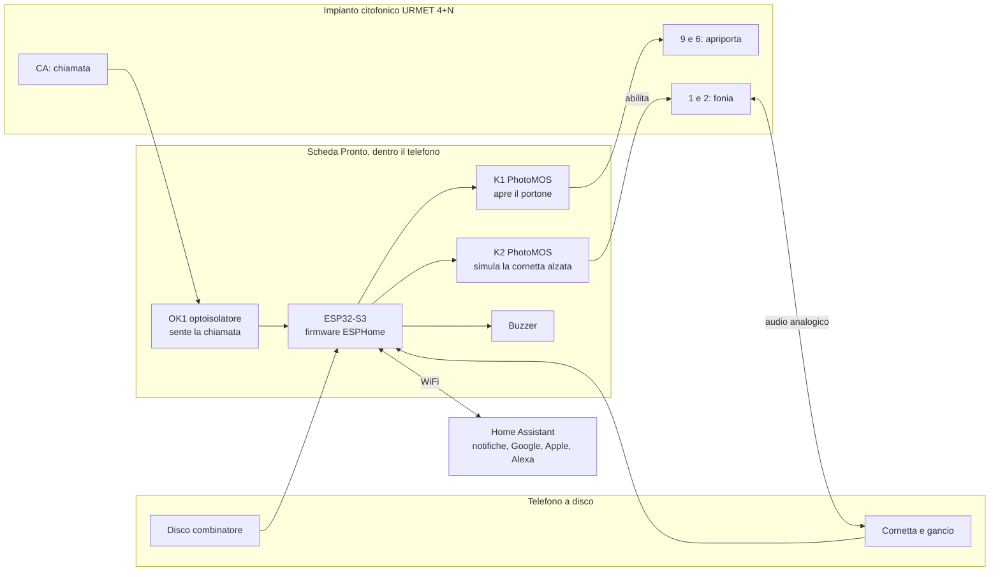

# Pronto — il citofono smart dentro un telefono a disco

**Pronto** è una scheda elettronica open hardware che trasforma un telefono a disco d'epoca in un **citofono smart**. Il telefono resta com'è, fuori e nell'uso:

- alzi la cornetta per parlare con chi ha suonato;
- componi un numero con il disco e il portone si apre.

In più arrivano:

- la notifica sul cellulare quando qualcuno suona;
- l'apertura del portone da remoto;
- l'integrazione con Home Assistant e, tramite Home Assistant, con Google Home, Apple Home e Alexa.

La scheda ha **esattamente la forma della scheda originale** e si avvita al suo posto, senza forare né modificare il guscio.

> **Compatibilità:** telefoni **Siemens / Italtel S62** (versione da parete) e impianti citofonici **URMET 4+N** analogici.
> Altri telefoni e impianti: vedi [Compatibilità](docs/compatibilita.md).


---

> [!WARNING]
> **Progetto in fase di prototipo.** La scheda rev 0.5 è stata ordinata (5 esemplari assemblati) ma **non è ancora stata collaudata**.
> Il firmware è validato, ma non ancora provato sull'hardware vero.
> Se vuoi costruirla adesso sei il benvenuto, ma aspettati di dover correggere qualcosa. Lo stato aggiornato è nel [CHANGELOG](CHANGELOG.md).

## Indice

- [Cosa fa](#cosa-fa)
- [Come funziona in breve](#come-funziona-in-breve)
- [Cosa serve](#cosa-serve)
- [Da dove iniziare](#da-dove-iniziare)
- [Struttura della repository](#struttura-della-repository)
- [Roadmap](#roadmap)
- [Sicurezza](#sicurezza)
- [Contribuire](#contribuire)
- [Licenze](#licenze)
- [English summary](#english-summary)

## Cosa fa

| Funzione | Come si usa |
|---|---|
| **Rispondere** | Come sempre: alzi la cornetta e parli. L'audio passa in analogico, la scheda non lo tocca |
| **Aprire con il disco** | Componi un numero qualsiasi e il portone si apre, come facevano molti citofoni-telefono d'epoca. Opzionale: un **codice segreto** da comporre |
| **Suoneria** | Quando suonano al portone, il buzzer della scheda squilla con un doppio squillo da telefono. La suoneria originale a campanelli si può collegare in via sperimentale |
| **Notifica sul cellulare** | Arriva una notifica con il pulsante **"Apri il portone"** dentro |
| **Apertura remota** | Da Home Assistant, dalla notifica, dall'assistente vocale o dalla pagina web della scheda |
| **Non disturbare** | Silenzia lo squillo; la notifica arriva comunque |
| **Apertura automatica** | Apre da sola alla chiamata, utile per feste o consegne attese. Si disattiva da sola al riavvio |
| **Storico** | Ultima chiamata, ultima apertura, contatore delle chiamate |
| **Pagina web locale** | `http://citofono-vintage.local` funziona anche senza Home Assistant |
| **Ascolto e risposta da remoto** | *In sviluppo:* scheda audio aggiuntiva con codec ES8311. Vedi [hardware/audio-board](hardware/audio-board/README.md) |

## Come funziona in breve



**Isolamento dall'impianto.** La scheda non ha nessun collegamento elettrico diretto con l'impianto condominiale. Sente la chiamata con un optoisolatore e apre il portone con relè allo stato solido PhotoMOS, che isolano otticamente. La massa dell'elettronica resta così separata dalla linea del citofono.

Il funzionamento completo è in **[docs/come-funziona.md](docs/come-funziona.md)**: ogni blocco del circuito, le sequenze di apertura, i tempi del disco e le sicurezze del firmware.

## Cosa serve

| Cosa | Note |
|---|---|
| Un telefono **S62 da parete** | Si trova nei mercatini e online. Deve avere disco, cornetta e gancio funzionanti |
| La scheda **Pronto** | Si ordina già assemblata da JLCPCB con i file pronti in [`hardware/mainboard/production`](hardware/mainboard/production): vedi [Ordinare la scheda](docs/ordinare-la-scheda.md) |
| Componenti da saldare a mano | Il relè K1 (a foro passante, da DigiKey/Mouser) e le morsettiere a vite. Sono saldature facili |
| **Alimentazione** | L'impianto URMET 4+N non alimenta il posto interno. Serve un alimentatore su J1, **9–36 V DC o 9–24 V AC** (per esempio 12 V DC da 1 A), oppure **5 V da USB-C** |
| WiFi di casa | Home Assistant è consigliato ma non obbligatorio |
| Attrezzatura | Saldatore, tester, cacciavite. Un computer con [ESPHome](https://esphome.io) per il primo caricamento del firmware via USB-C |

Il costo indicativo dei componenti è di circa 40 € a scheda su 5 prototipi assemblati. Scende molto con quantità maggiori.

## Da dove iniziare

1. **Verifica la compatibilità** del tuo impianto e del tuo telefono: [docs/compatibilita.md](docs/compatibilita.md)
2. **Ordina e monta la scheda:** [docs/ordinare-la-scheda.md](docs/ordinare-la-scheda.md)
3. **Carica il firmware:** [firmware/README.md](firmware/README.md)
4. **Installa la scheda nel telefono e collegala al citofono:** [docs/installazione.md](docs/installazione.md)
5. **Collauda, un passo alla volta:** [docs/collaudo.md](docs/collaudo.md)
6. **Collega Home Assistant e le notifiche:** [docs/home-assistant.md](docs/home-assistant.md)

Domande frequenti: [docs/faq.md](docs/faq.md)

## Struttura della repository

```
pronto-citofono/
├── hardware/
│   ├── mainboard/          Scheda principale (KiCad): schema, PCB, PDF
│   │   └── production/     Gerber, BOM e posizionamento pronti per JLCPCB
│   ├── audio-board/        Scheda audio ES8311 (ascolto e risposta da remoto), solo schema
│   └── mechanical/         Contorno della scheda S62 in DXF
├── firmware/               Firmware ESPHome (+ pacchetto per la scheda audio)
├── home-assistant/         Automazioni di esempio (notifica con pulsante "Apri")
├── docs/                   Documentazione: funzionamento, installazione, collaudo...
├── LICENSES/               Testi delle licenze
└── CHANGELOG.md            Storia delle revisioni
```

## Roadmap

- [x] Rilievo meccanico della scheda originale S62 e contorno in DXF
- [x] Schema elettrico e PCB rev 0.5 nella forma della scheda originale
- [x] Firmware ESPHome con apertura da disco, notifiche e apertura remota
- [x] Schema della scheda audio (ES8311) per ascolto e risposta da remoto
- [ ] Collaudo dei prototipi rev 0.5 su impianto URMET reale
- [ ] PCB della scheda audio e integrazione della chiamata vocale sul cellulare
- [ ] Guida fotografica al montaggio e sito del progetto
- [ ] Versione più economica e semplificata della scheda (ESP32 direttamente sulla scheda, meno componenti)
- [ ] Compatibilità con altri impianti 4+N e con altri telefoni a disco

## Sicurezza

- La scheda lavora solo con **bassissime tensioni**: 12 V AC di chiamata, al massimo circa 30 V DC sulla linea citofonica, 9–36 V di alimentazione. **Non va mai collegata alla rete a 230 V.**
- L'impianto citofonico è spesso **condominiale**. Prima di intervenire sul tuo posto interno, verifica di poterlo fare. Scollega il vecchio citofono solo dopo aver identificato i morsetti con il tester.
- L'apertura remota apre davvero il portone di casa. Proteggi Home Assistant e la pagina web della scheda con password robuste, e non esporre la scheda direttamente su Internet.
- Il progetto è fornito **così com'è**, senza garanzie (vedi [Licenze](#licenze)). Chi lo costruisce e lo installa ne è responsabile.

## Contribuire

Il contributo più prezioso adesso è sapere **su quali impianti e telefoni funziona**.
Se lo provi, apri una [segnalazione di compatibilità](../../issues/new?template=compatibilita.md), anche se non funziona. Servono marca e modello dell'impianto e del telefono, e le misure fatte.

Correzioni, foto del montaggio e traduzioni sono benvenute: vedi [CONTRIBUTING.md](CONTRIBUTING.md).

## Licenze

| Parte | Licenza |
|---|---|
| Hardware (`hardware/`) | [CERN-OHL-S v2](LICENSES/CERN-OHL-S-2.0.txt) |
| Firmware e configurazioni (`firmware/`, `home-assistant/`) | [MIT](LICENSES/MIT.txt) |
| Documentazione e immagini (`docs/`, file `.md`) | [CC BY-SA 4.0](LICENSES/CC-BY-SA-4.0.txt) |

I dettagli sono in [LICENSE.md](LICENSE.md).

**Marchi.** Siemens, Italtel e URMET sono marchi dei rispettivi proprietari. Sono citati solo per indicare la compatibilità. Questo è un progetto indipendente, non affiliato né approvato da loro.
Il telefono S62 è un classico del design industriale italiano, disegnato da Lino Saltini negli anni '60. Questo progetto non ne riproduce il guscio: ne sostituisce solo l'elettronica interna.

---

## English summary

**Pronto** is an open-hardware board that turns a vintage **Siemens / Italtel S62** rotary phone (wall version) into a **smart door intercom** for Italian **URMET 4+N** analog intercom systems. It is a drop-in replacement for the phone's original circuit board, with the same shape and mounting holes.

The phone keeps working as before:
- lift the handset to talk;
- dial any number, or an optional secret code, to open the door.

An ESP32-S3 running **ESPHome** adds:
- doorbell notifications with an "open" button;
- remote door opening;
- call history;
- Home Assistant integration, and through it Google Home, Apple Home and Alexa.

The electronics are galvanically isolated from the intercom line (optocoupler and PhotoMOS relays).

**Status:** prototype rev 0.5 ordered, not yet tested on real hardware.

What is in the repository:
- KiCad sources and JLCPCB-ready production files: [`hardware/`](hardware/)
- ESPHome firmware: [`firmware/`](firmware/)
- Documentation, currently in Italian only: [`docs/`](docs/)

Translations and compatibility reports from other intercom systems are very welcome.

Licenses: CERN-OHL-S v2 (hardware), MIT (firmware), CC BY-SA 4.0 (docs).
