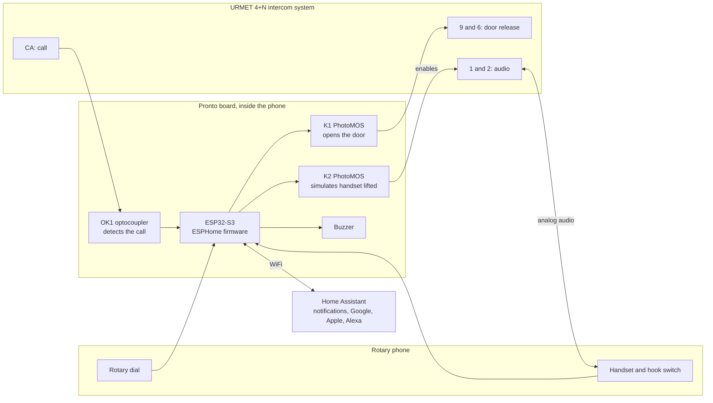
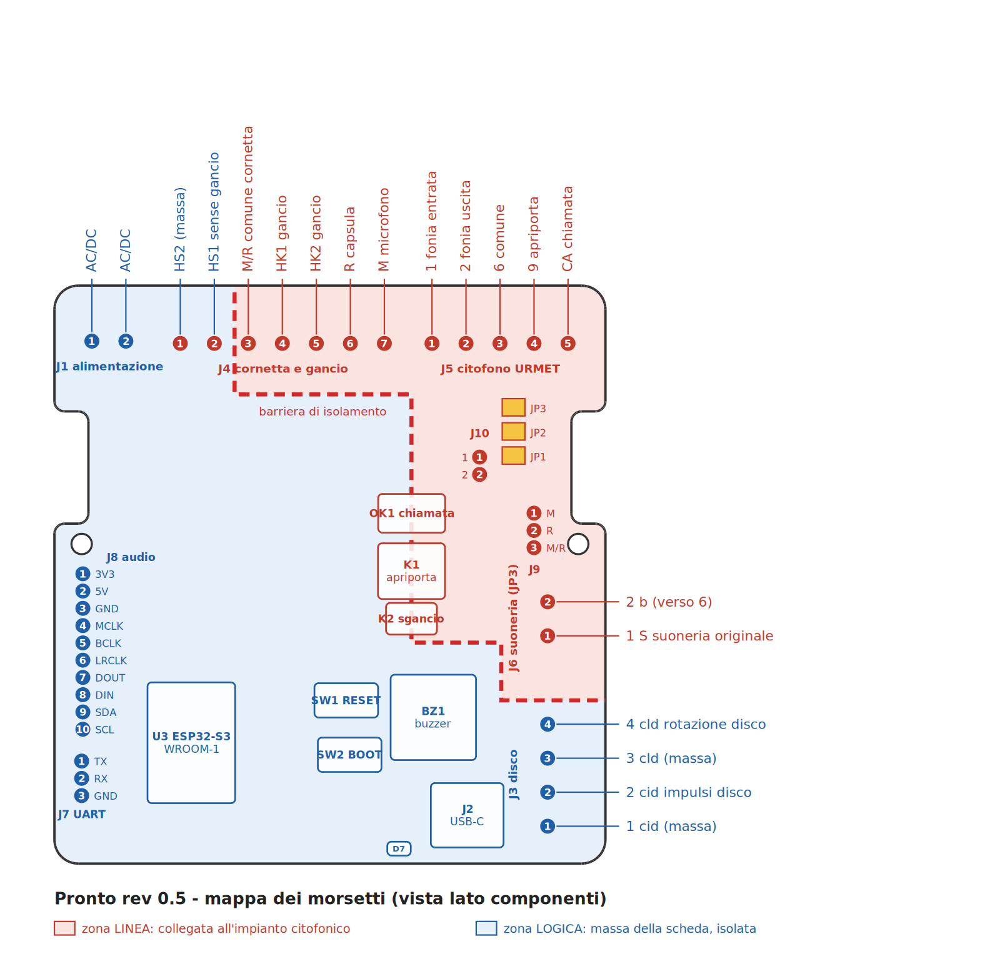
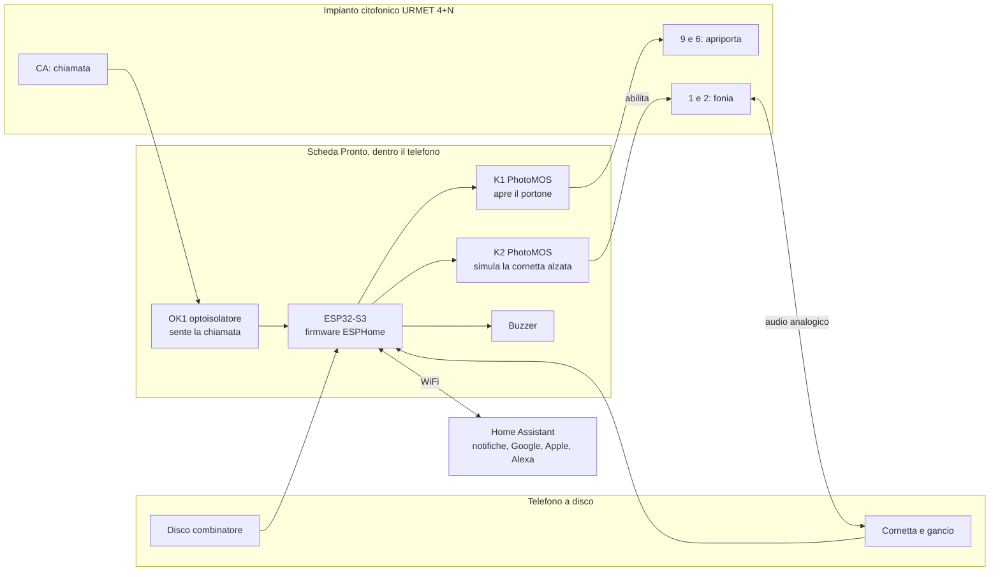

# Pronto — a smart door intercom inside a vintage rotary phone

🇬🇧 English · [🇮🇹 Italiano](#-versione-italiana)

**Pronto** is an open-hardware circuit board that turns a vintage rotary phone into a **smart door intercom**. The phone looks and works exactly as before:

- lift the handset to talk to whoever rang;
- dial a number and the street door opens.

On top of that you get:

- a notification on your phone when someone rings;
- remote door opening;
- Home Assistant integration and, through Home Assistant, Google Home, Apple Home and Alexa.

The board has **exactly the shape of the original one** and screws into its place, with no drilling or changes to the shell.

> **Compatibility:** **Siemens / Italtel S62** phones (wall-mounted version) and **URMET 4+N** analog intercom systems, very common in Italian apartment buildings.
> Other phones and systems: see [Compatibility](docs/compatibilita.md) (in Italian).


---

> [!WARNING]
> **Prototype stage.** Board rev 0.5 has been ordered (5 assembled boards) but **has not been tested yet**.
> The firmware is validated, but not yet tried on real hardware.
> You are welcome to build one now, but expect to fix something along the way. Current status is in the [CHANGELOG](CHANGELOG.md).

## Contents

- [What it does](#what-it-does)
- [How it works, in short](#how-it-works-in-short)
- [Board pinout](#board-pinout)
- [What you need](#what-you-need)
- [Getting started](#getting-started)
- [Repository layout](#repository-layout)
- [Roadmap](#roadmap)
- [Safety](#safety)
- [Contributing](#contributing)
- [Licenses](#licenses)
- [🇮🇹 Versione italiana](#-versione-italiana)

## What it does

| Feature | How it works |
|---|---|
| **Answering** | As always: lift the handset and talk. Audio passes through in analog form; the board does not touch it |
| **Open with the dial** | Dial any number and the door opens, as many vintage intercom phones did. Optional: a **secret code** to dial |
| **Ringing** | When someone rings at the street door, the board's buzzer plays a classic double ring. The phone's original bells can be connected experimentally |
| **Phone notification** | A notification arrives with an **"Open the door"** button in it |
| **Remote opening** | From Home Assistant, the notification, a voice assistant or the board's own web page |
| **Do not disturb** | Silences the ring; the notification still arrives |
| **Auto-open** | Opens by itself when someone rings, handy for parties or expected deliveries. Turns itself off on reboot |
| **History** | Last call, last opening, call counter |
| **Local web page** | `http://citofono-vintage.local` works even without Home Assistant |
| **Remote listening and talking** | *In development:* an add-on audio board with an ES8311 codec. See [hardware/audio-board](hardware/audio-board/README.md) |

## How it works, in short



**Isolation from the building system.** The board has no direct electrical connection to the shared intercom line. It detects the call with an optocoupler and opens the door with PhotoMOS solid-state relays, which are optically isolated. The electronics' ground stays separate from the intercom line.

The full description is in **[docs/come-funziona.md](docs/come-funziona.md)** (in Italian): every circuit block, the opening sequences, dial timing and firmware safety features.

## Board pinout



The labels are in Italian. Key terms:

| Label | Meaning |
|---|---|
| alimentazione | power input |
| cornetta, capsula, microfono | handset, earpiece, microphone |
| gancio | hook switch |
| fonia entrata / uscita | audio in (from street) / audio out (to street) |
| comune | common |
| apriporta | door release |
| chiamata | call |
| suoneria | ringer bells |
| disco, impulsi, rotazione | dial, pulses, dial-in-motion contact |
| massa | ground |
| zona linea / zona logica | intercom-line side / isolated logic side |
| barriera di isolamento | isolation barrier |

Step-by-step wiring of dial, hook, handset and intercom is in [docs/installazione.md](docs/installazione.md).

## What you need

| Item | Notes |
|---|---|
| An **S62 wall phone** | Found at flea markets and online. Dial, handset and hook switch must work |
| The **Pronto** board | Order it pre-assembled from JLCPCB with the ready-made files in [`hardware/mainboard/production`](hardware/mainboard/production): see [Ordering the board](docs/ordinare-la-scheda.md) |
| Hand-soldered parts | The K1 relay (through-hole, from DigiKey/Mouser) and the screw terminals. Easy soldering |
| **Power** | URMET 4+N systems do not power the indoor unit. You need a supply on J1, **9–36 V DC or 9–24 V AC** (for example 12 V DC, 1 A), or **5 V from USB-C** |
| Home WiFi | Home Assistant is recommended but not required |
| Tools | Soldering iron, multimeter, screwdriver. A computer with [ESPHome](https://esphome.io) for the first firmware upload over USB-C |

Indicative parts cost is about €40 per board for 5 assembled prototypes. It drops a lot with larger quantities.

## Getting started

The detailed guides are currently in Italian; translations are welcome.

1. **Check compatibility** of your intercom and phone: [docs/compatibilita.md](docs/compatibilita.md)
2. **Order and assemble the board:** [docs/ordinare-la-scheda.md](docs/ordinare-la-scheda.md)
3. **Upload the firmware:** [firmware/README.md](firmware/README.md)
4. **Install the board in the phone and wire it to the intercom:** [docs/installazione.md](docs/installazione.md)
5. **Test it, one step at a time:** [docs/collaudo.md](docs/collaudo.md)
6. **Connect Home Assistant and notifications:** [docs/home-assistant.md](docs/home-assistant.md)

FAQ: [docs/faq.md](docs/faq.md)

## Repository layout

```
citofono-vintage/
├── hardware/
│   ├── mainboard/          Main board (KiCad): schematic, PCB, PDF
│   │   └── production/     Gerber, BOM and placement files ready for JLCPCB
│   ├── audio-board/        ES8311 audio board (remote listen/talk), schematic only
│   └── mechanical/         S62 board outline as DXF
├── firmware/               ESPHome firmware (+ package for the audio board)
├── home-assistant/         Example automations (notification with "Open" button)
├── docs/                   Documentation: how it works, installation, testing...
├── LICENSES/               License texts
└── CHANGELOG.md            Revision history
```

## Roadmap

- [x] Mechanical survey of the original S62 board and DXF outline
- [x] Schematic and PCB rev 0.5 in the original board's shape
- [x] ESPHome firmware with dial opening, notifications and remote opening
- [x] Audio board schematic (ES8311) for remote listening and talking
- [ ] Testing the rev 0.5 prototypes on a real URMET system
- [ ] Audio board PCB and voice calls on the phone
- [ ] Photo assembly guide and project website
- [ ] Cheaper, simplified board (ESP32 chip directly on the board, fewer parts)
- [ ] Support for other 4+N systems and other rotary phones
- [ ] English translation of the documentation

## Safety

- The board works only with **extra-low voltages**: 12 V AC call signal, at most about 30 V DC on the intercom line, 9–36 V supply. **Never connect it to 230 V mains.**
- The intercom system is often **shared by the whole building**. Make sure you are allowed to work on your indoor unit. Disconnect the old intercom only after identifying the terminals with a multimeter.
- Remote opening really opens your front door. Protect Home Assistant and the board's web page with strong passwords, and never expose the board directly to the Internet.
- The project is provided **as is**, without warranty (see [Licenses](#licenses)). Whoever builds and installs it is responsible for it.

## Contributing

The most valuable contribution right now is knowing **which intercom systems and phones it works with**.
If you try it, open a [compatibility report](../../issues/new?template=compatibilita.md), even if it does not work. Include make and model of the intercom and phone, and your measurements.

Fixes, assembly photos and translations are welcome: see [CONTRIBUTING.md](CONTRIBUTING.md).

## Licenses

| Part | License |
|---|---|
| Hardware (`hardware/`) | [CERN-OHL-S v2](LICENSES/CERN-OHL-S-2.0.txt) |
| Firmware and configuration (`firmware/`, `home-assistant/`) | [MIT](LICENSES/MIT.txt) |
| Documentation and images (`docs/`, `.md` files) | [CC BY-SA 4.0](LICENSES/CC-BY-SA-4.0.txt) |

Details are in [LICENSE.md](LICENSE.md).

**Trademarks.** Siemens, Italtel and URMET are trademarks of their respective owners. They are mentioned only to indicate compatibility. This is an independent project, not affiliated with or endorsed by them.
The S62 phone is a classic of Italian industrial design, designed by Lino Saltini in the 1960s. This project does not reproduce its shell: it only replaces the electronics inside.

---

## 🇮🇹 Versione italiana

[🇬🇧 English](#contents) · 🇮🇹 Italiano

**Pronto — il citofono smart dentro un telefono a disco**

**Pronto** è una scheda elettronica open hardware che trasforma un telefono a disco d'epoca in un **citofono smart**. Il telefono resta com'è, fuori e nell'uso:

- alzi la cornetta per parlare con chi ha suonato;
- componi un numero con il disco e il portone si apre.

In più arrivano:

- la notifica sul cellulare quando qualcuno suona;
- l'apertura del portone da remoto;
- l'integrazione con Home Assistant e, tramite Home Assistant, con Google Home, Apple Home e Alexa.

La scheda ha **esattamente la forma della scheda originale** e si avvita al suo posto, senza forare né modificare il guscio.

> **Compatibilità:** telefoni **Siemens / Italtel S62** (versione da parete) e impianti citofonici **URMET 4+N** analogici.
> Altri telefoni e impianti: vedi [Compatibilità](docs/compatibilita.md).


> [!WARNING]
> **Progetto in fase di prototipo.** La scheda rev 0.5 è stata ordinata (5 esemplari assemblati) ma **non è ancora stata collaudata**.
> Il firmware è validato, ma non ancora provato sull'hardware vero.
> Se vuoi costruirla adesso sei il benvenuto, ma aspettati di dover correggere qualcosa. Lo stato aggiornato è nel [CHANGELOG](CHANGELOG.md).

### Indice

- [Cosa fa](#cosa-fa)
- [Come funziona in breve](#come-funziona-in-breve)
- [Mappa dei morsetti](#mappa-dei-morsetti)
- [Cosa serve](#cosa-serve)
- [Da dove iniziare](#da-dove-iniziare)
- [Struttura della repository](#struttura-della-repository)
- [Prossimi passi](#prossimi-passi)
- [Sicurezza](#sicurezza)
- [Contribuire](#contribuire)
- [Licenze](#licenze)

### Cosa fa

| Funzione | Come si usa |
|---|---|
| **Rispondere** | Come sempre: alzi la cornetta e parli. L'audio passa in analogico, la scheda non lo tocca |
| **Aprire con il disco** | Componi un numero qualsiasi e il portone si apre, come facevano molti citofoni-telefono d'epoca. Opzionale: un **codice segreto** da comporre |
| **Suoneria** | Quando suonano al portone, il buzzer della scheda squilla con un doppio squillo da telefono. La suoneria originale a campanelli si può collegare in via sperimentale |
| **Notifica sul cellulare** | Arriva una notifica con il pulsante **"Apri il portone"** dentro |
| **Apertura remota** | Da Home Assistant, dalla notifica, dall'assistente vocale o dalla pagina web della scheda |
| **Non disturbare** | Silenzia lo squillo; la notifica arriva comunque |
| **Apertura automatica** | Apre da sola alla chiamata, utile per feste o consegne attese. Si disattiva da sola al riavvio |
| **Storico** | Ultima chiamata, ultima apertura, contatore delle chiamate |
| **Pagina web locale** | `http://citofono-vintage.local` funziona anche senza Home Assistant |
| **Ascolto e risposta da remoto** | *In sviluppo:* scheda audio aggiuntiva con codec ES8311. Vedi [hardware/audio-board](hardware/audio-board/README.md) |

### Come funziona in breve



**Isolamento dall'impianto.** La scheda non ha nessun collegamento elettrico diretto con l'impianto condominiale. Sente la chiamata con un optoisolatore e apre il portone con relè allo stato solido PhotoMOS, che isolano otticamente. La massa dell'elettronica resta così separata dalla linea del citofono.

Il funzionamento completo è in **[docs/come-funziona.md](docs/come-funziona.md)**: ogni blocco del circuito, le sequenze di apertura, i tempi del disco e le sicurezze del firmware.

### Mappa dei morsetti


Il collegamento passo passo di disco, gancio, cornetta e citofono è in [docs/installazione.md](docs/installazione.md).

### Cosa serve

| Cosa | Note |
|---|---|
| Un telefono **S62 da parete** | Si trova nei mercatini e online. Deve avere disco, cornetta e gancio funzionanti |
| La scheda **Pronto** | Si ordina già assemblata da JLCPCB con i file pronti in [`hardware/mainboard/production`](hardware/mainboard/production): vedi [Ordinare la scheda](docs/ordinare-la-scheda.md) |
| Componenti da saldare a mano | Il relè K1 (a foro passante, da DigiKey/Mouser) e le morsettiere a vite. Sono saldature facili |
| **Alimentazione** | L'impianto URMET 4+N non alimenta il posto interno. Serve un alimentatore su J1, **9–36 V DC o 9–24 V AC** (per esempio 12 V DC da 1 A), oppure **5 V da USB-C** |
| WiFi di casa | Home Assistant è consigliato ma non obbligatorio |
| Attrezzatura | Saldatore, tester, cacciavite. Un computer con [ESPHome](https://esphome.io) per il primo caricamento del firmware via USB-C |

Il costo indicativo dei componenti è di circa 40 € a scheda su 5 prototipi assemblati. Scende molto con quantità maggiori.

### Da dove iniziare

1. **Verifica la compatibilità** del tuo impianto e del tuo telefono: [docs/compatibilita.md](docs/compatibilita.md)
2. **Ordina e monta la scheda:** [docs/ordinare-la-scheda.md](docs/ordinare-la-scheda.md)
3. **Carica il firmware:** [firmware/README.md](firmware/README.md)
4. **Installa la scheda nel telefono e collegala al citofono:** [docs/installazione.md](docs/installazione.md)
5. **Collauda, un passo alla volta:** [docs/collaudo.md](docs/collaudo.md)
6. **Collega Home Assistant e le notifiche:** [docs/home-assistant.md](docs/home-assistant.md)

Domande frequenti: [docs/faq.md](docs/faq.md)

### Struttura della repository

```
citofono-vintage/
├── hardware/
│   ├── mainboard/          Scheda principale (KiCad): schema, PCB, PDF
│   │   └── production/     Gerber, BOM e posizionamento pronti per JLCPCB
│   ├── audio-board/        Scheda audio ES8311 (ascolto e risposta da remoto), solo schema
│   └── mechanical/         Contorno della scheda S62 in DXF
├── firmware/               Firmware ESPHome (+ pacchetto per la scheda audio)
├── home-assistant/         Automazioni di esempio (notifica con pulsante "Apri")
├── docs/                   Documentazione: funzionamento, installazione, collaudo...
├── LICENSES/               Testi delle licenze
└── CHANGELOG.md            Storia delle revisioni
```

### Prossimi passi

- [x] Rilievo meccanico della scheda originale S62 e contorno in DXF
- [x] Schema elettrico e PCB rev 0.5 nella forma della scheda originale
- [x] Firmware ESPHome con apertura da disco, notifiche e apertura remota
- [x] Schema della scheda audio (ES8311) per ascolto e risposta da remoto
- [ ] Collaudo dei prototipi rev 0.5 su impianto URMET reale
- [ ] PCB della scheda audio e integrazione della chiamata vocale sul cellulare
- [ ] Guida fotografica al montaggio e sito del progetto
- [ ] Versione più economica e semplificata della scheda (ESP32 direttamente sulla scheda, meno componenti)
- [ ] Compatibilità con altri impianti 4+N e con altri telefoni a disco
- [ ] Traduzione in inglese della documentazione

### Sicurezza

- La scheda lavora solo con **bassissime tensioni**: 12 V AC di chiamata, al massimo circa 30 V DC sulla linea citofonica, 9–36 V di alimentazione. **Non va mai collegata alla rete a 230 V.**
- L'impianto citofonico è spesso **condominiale**. Prima di intervenire sul tuo posto interno, verifica di poterlo fare. Scollega il vecchio citofono solo dopo aver identificato i morsetti con il tester.
- L'apertura remota apre davvero il portone di casa. Proteggi Home Assistant e la pagina web della scheda con password robuste, e non esporre la scheda direttamente su Internet.
- Il progetto è fornito **così com'è**, senza garanzie (vedi [Licenze](#licenze)). Chi lo costruisce e lo installa ne è responsabile.

### Contribuire

Il contributo più prezioso adesso è sapere **su quali impianti e telefoni funziona**.
Se lo provi, apri una [segnalazione di compatibilità](../../issues/new?template=compatibilita.md), anche se non funziona. Servono marca e modello dell'impianto e del telefono, e le misure fatte.

Correzioni, foto del montaggio e traduzioni sono benvenute: vedi [CONTRIBUTING.md](CONTRIBUTING.md).

### Licenze

| Parte | Licenza |
|---|---|
| Hardware (`hardware/`) | [CERN-OHL-S v2](LICENSES/CERN-OHL-S-2.0.txt) |
| Firmware e configurazioni (`firmware/`, `home-assistant/`) | [MIT](LICENSES/MIT.txt) |
| Documentazione e immagini (`docs/`, file `.md`) | [CC BY-SA 4.0](LICENSES/CC-BY-SA-4.0.txt) |

I dettagli sono in [LICENSE.md](LICENSE.md).

**Marchi.** Siemens, Italtel e URMET sono marchi dei rispettivi proprietari. Sono citati solo per indicare la compatibilità. Questo è un progetto indipendente, non affiliato né approvato da loro.
Il telefono S62 è un classico del design industriale italiano, disegnato da Lino Saltini negli anni '60. Questo progetto non ne riproduce il guscio: ne sostituisce solo l'elettronica interna.
