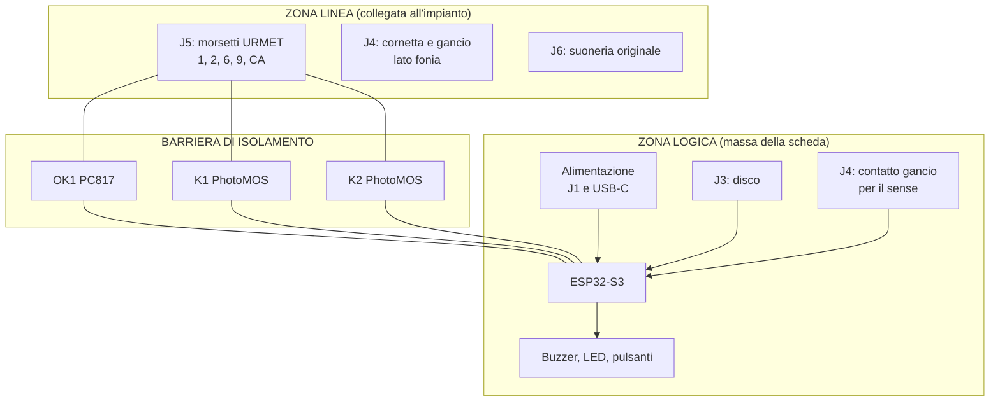
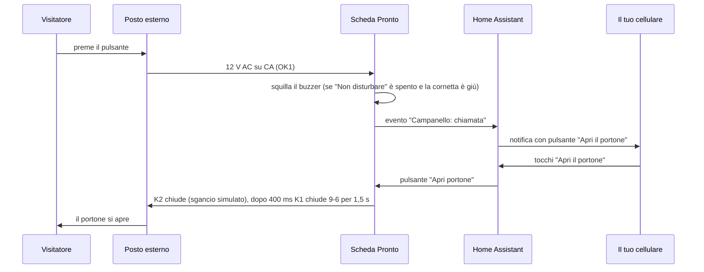

# Come funziona

Questa pagina descrive la scheda **rev 0.5** blocco per blocco e il comportamento del firmware.

Gli schemi completi sono in [`hardware/mainboard/CitofonoVintage_schematic.pdf`](../hardware/mainboard/CitofonoVintage_schematic.pdf). I riferimenti dei componenti (R14, K1, ...) sono quelli dello schema.

- [1. Il principio: come funziona un citofono 4+N](#1-il-principio-come-funziona-un-citofono-4n)
- [2. Architettura della scheda](#2-architettura-della-scheda)
- [3. Blocco A1: alimentazione](#3-blocco-a1-alimentazione)
- [4. Blocco A2: interfaccia verso il citofono](#4-blocco-a2-interfaccia-verso-il-citofono)
- [5. Blocco A3: interfaccia verso il telefono](#5-blocco-a3-interfaccia-verso-il-telefono)
- [6. Blocco B: il cervello (ESP32-S3)](#6-blocco-b-il-cervello-esp32-s3)
- [7. Isolamento e layout](#7-isolamento-e-layout)
- [8. Il firmware](#8-il-firmware)
- [9. Scheda audio (in sviluppo)](#9-scheda-audio-in-sviluppo)

---

## 1. Il principio: come funziona un citofono 4+N

Nei citofoni analogici "4+N" ogni appartamento è collegato al posto esterno (la pulsantiera sul portone) da alcuni fili comuni a tutti più un filo di chiamata personale. Sull'impianto **URMET 4+N** (scheda di chiamata CS 1133) usato per sviluppare il progetto, i morsetti del posto interno sono:

| Morsetto | Funzione |
|---|---|
| **1** | Fonia entrata: la voce che arriva dalla strada, va alla capsula della cornetta |
| **2** | Fonia uscita: la voce dal microfono della cornetta verso la strada |
| **6** | Comune (riferimento per tutti gli altri) |
| **9** | Apriporta: **chiudendo 9 con 6 il portone si apre** |
| **CA** | Chiamata: quando qualcuno suona, fra **CA e 6** arrivano circa **12 V AC** |

In un citofono tradizionale:
- il pulsante a chiave chiude 9 con 6;
- il ronzatore è collegato fra CA e 6;
- quando alzi la cornetta, il gancio collega il comune della cornetta al morsetto 6 e "accende" la fonia.

La scheda Pronto fa esattamente queste cose, ma con componenti elettronici comandati dal disco del telefono e dall'ESP32.

> **Importante:** il posto interno di un 4+N **non riceve alimentazione** dalla linea. La tensione su CA c'è solo durante la chiamata. Per questo la scheda va alimentata a parte (vedi il blocco A1).

## 2. Architettura della scheda

La scheda è divisa in due zone separate da una **barriera di isolamento**, cioè una striscia senza rame sul circuito stampato:



- **Zona linea:** tutto ciò che tocca i fili dell'impianto condominiale.
- **Zona logica:** l'ESP32, l'alimentazione e i contatti "asciutti" del telefono (disco e un contatto del gancio).
- **A cavallo della barriera:** solo tre componenti a isolamento ottico. Il loro lato LED sta da una parte e il lato uscita dall'altra.

## 3. Blocco A1: alimentazione

```
J1 (AC o DC) → F1 fusibile ripristinabile 0,5 A → D1 ponte ABS10 → D2 TVS SMAJ36A
            → U1 LM5164 (buck, 5 V, 1 A) → D3 ─┐
USB-C VBUS  ─────────────────────────────→ D4 ─┴→ +5V → U2 AMS1117 → +3V3 → ESP32
```

- **Ingresso J1:** polarità indifferente, AC o DC, grazie al ponte D1.
  - **DC da 9 a 36 V.** Il TVS D2 protegge dai disturbi e inizia a condurre oltre i 36 V circa.
  - **AC da 9 a 24 V**, per esempio il secondario 12 V AC di un trasformatore citofonico.
- **U1 LM5164** (Texas Instruments): convertitore buck da 1 A con ingresso fino a 100 V e consumo a vuoto bassissimo.
  - RON = 49,9 kΩ, frequenza circa 250 kHz.
  - Partitore R4/R5 = 100 k / 31,6 k, uscita 5,0 V.
  - Partitore R1/R2: sotto circa 7,5 V il convertitore resta spento (UVLO) invece di funzionare male.
- **OR con l'USB:** D3 e D4 (Schottky SS34) permettono di alimentare la scheda da J1, da USB-C o da entrambi senza conflitti. L'USB basta anche per l'uso quotidiano, non solo per programmare.
- **U2 AMS1117-3.3:** LDO da 1 A per l'ESP32.
- **C9 da 470 µF:** vicino al modulo, assorbe i picchi di corrente del WiFi (300–500 mA) che altrimenti farebbero riavviare l'ESP32 (brown-out).

**Consumo:** qualche decina di mA a riposo, con picchi durante la trasmissione WiFi. Un alimentatore da 12 V DC 1 A o un caricatore USB da 5 V 1 A sono più che sufficienti.

## 4. Blocco A2: interfaccia verso il citofono

### Rilevamento della chiamata: OK1

```
CA ── D5 (1N4148W) ── R14 15 kΩ ── LED di OK1 ── 6          (zona linea)
                                   transistor di OK1 → IO6   (zona logica)
```

- Durante la chiamata, i 12 V AC su CA vengono raddrizzati a semionda da D5 e accendono il LED dell'optoisolatore PC817. Il transistor porta a massa l'ingresso IO6 (pull-up R13 10 kΩ).
- R14 è dimensionata sul caso peggiore di 31 V DC (circa 2 mA nel LED) e funziona ancora bene a 12 V AC.
- C12 (4,7 µF) e il filtro firmware da 1,5 s trasformano gli impulsi a 50 Hz in un segnale stabile "chiamata in corso".

### Apriporta: K1

- **K1** è un relè allo stato solido PhotoMOS (**TLP3546A** oppure **AQV252G**, entrambi DIP-6 a foro passante).
- L'ESP32 accende il suo LED da IO7 tramite R15 (390 Ω). L'uscita chiude il contatto **9 ↔ 6**, esattamente come il pulsante a chiave del citofono originale.
- Il PhotoMOS è bidirezionale (AC e DC, fino a 60 V). Funziona sia con i circuiti apriporta in alternata sia con quelli in continua.
- Non ha parti in movimento né rimbalzi e non fa rumore.

### Sgancio simulato: K2

- **K2** (CPC1017N, PhotoMOS 60 V 1 A) è collegato **in parallelo al contatto del gancio** che unisce il comune della cornetta al morsetto 6. L'ESP32 lo comanda da IO17 tramite R16 (560 Ω).
- Chiudendo K2 la scheda "alza la cornetta" elettricamente. Su molti impianti URMET serve perché l'apriporta venga accettato anche quando nessuno ha alzato la cornetta, ed è anche il modo di aprire la fonia per la futura risposta da remoto.
- Se sul tuo impianto non serve, il firmware permette di disattivarlo (vedi il paragrafo 8).

## 5. Blocco A3: interfaccia verso il telefono

### Il disco combinatore (J3)

Il disco dell'S62 ha due contatti:

| Contatto | Morsetti J3 | Comportamento | GPIO |
|---|---|---|---|
| **cid**: impulsi | 1-2 | Chiuso a riposo, **si apre a ogni impulso** | IO4 |
| **cld**: rotazione | 3-4 | Chiuso **mentre il disco torna indietro** | IO18 |

- Entrambi i contatti chiudono verso massa, con pull-up da 10 kΩ e un condensatore da 100 nF contro i disturbi.
- Il disco genera **10 impulsi al secondo**: circa 60 ms di apertura e 40 ms di chiusura.
- La cifra è il numero di impulsi, e 10 impulsi valgono **0**.

### Gancio e cornetta (J4, 7 morsetti)

| J4 | Nome | Collegamento | Zona |
|---|---|---|---|
| 1 | HS2 | Secondo contatto del gancio: massa | logica |
| 2 | HS1 | Secondo contatto del gancio: sense, IO5 | logica |
| 3 | M/R | Filo comune della cornetta | linea |
| 4 | HK1 | Contatto del gancio che accende la fonia: lato cornetta | linea |
| 5 | HK2 | Contatto del gancio che accende la fonia: lato morsetto 6 | linea |
| 6 | R | Capsula ricevente della cornetta | linea |
| 7 | M | Microfono della cornetta | linea |

- Il gancio dell'S62 ha più contatti e se ne usano **due indipendenti**:
  - **HK1-HK2** collega la cornetta al morsetto 6, come nel citofono originale;
  - **HS1-HS2** dice all'ESP32 se la cornetta è alzata.

  Sono due contatti separati, così la zona logica non tocca mai la linea.
- **Audio passante:** i ponticelli a saldare **JP1** (linea 1 ↔ capsula R) e **JP2** (linea 2 ↔ microfono M) sono **chiusi di fabbrica**. La voce passa in analogico come nel citofono originale: la scheda non la elabora e non la registra.
- JP1 e JP2 si tagliano solo se si monta la [scheda audio](#9-scheda-audio-in-sviluppo).

### Suoneria originale (J6, opzionale)

- Il suono della chiamata di serie lo fa il buzzer BZ1 della scheda.
- Chi vuole provare i campanelli originali dell'S62 (circa 1700 Ω) può collegarli a J6 e chiudere il ponticello **JP3**, che li mette fra CA e 6.
- È una **prova sperimentale**: non tutti gli impianti hanno abbastanza potenza sulla linea di chiamata per muovere i campanelli.

## 6. Blocco B: il cervello (ESP32-S3)

- **Modulo ESP32-S3-WROOM-1-N16R2:** 16 MB di flash, 2 MB di PSRAM, WiFi e Bluetooth, antenna integrata.
- **USB-C nativa** (IO19/IO20): programmazione, log e alimentazione. Non serve un convertitore USB-seriale.
  - Le resistenze CC da 5,1 kΩ fanno riconoscere la scheda a qualsiasi caricatore USB-C.
- **Pulsanti:** SW1 = RESET; SW2 = BOOT, che nel firmware serve anche a provare l'apriporta.
- **Buzzer BZ1:** TMB12A05, attivo, 5 V, pilotato da Q1 (MMBT3904) su IO15.
- **LED di stato D7:** IO8.
- **J7:** UART di debug (TX, RX, GND).
- **J8/J9/J10:** connettori di espansione per la scheda audio.
  - J8 porta 3,3 V, 5 V, GND, I2S (MCLK, BCLK, LRCLK, DOUT, DIN) e I2C (SDA, SCL).
  - J9 porta i fili della cornetta.
  - J10 porta la fonia di linea.

### Mappa dei GPIO

| Segnale | GPIO | Segnale | GPIO |
|---|---|---|---|
| DIAL_PULSE (disco, cid) | IO4 | I2S_BCLK | IO9 |
| HOOK_SENSE (gancio) | IO5 | I2S_LRCLK | IO10 |
| CALL_SENSE (OK1) | IO6 | I2S_DOUT | IO11 |
| DRIVE_OPEN (K1) | IO7 | I2S_DIN | IO12 |
| LED_STATUS | IO8 | I2C_SDA | IO13 |
| BUZZER | IO15 | I2C_SCL | IO14 |
| DRIVE_HOOK (K2) | IO17 | I2S_MCLK | IO16 |
| DIAL_ACTIVE (disco, cld) | IO18 | USB D-/D+ | IO19/IO20 |

- IO0 è il pulsante BOOT e EN è il RESET.
- Le uscite dei relè sono su pin che restano a livello basso durante l'avvio, così **nessun relè si chiude all'accensione**.

## 7. Isolamento e layout

- **PCB a 2 strati** con il contorno identico alla scheda originale dell'S62: 81 × 85 mm, due fori Ø 3 mm a 4 mm dal bordo e a 38 mm dall'alto, incavi laterali per il telaio. Il DXF è in [`hardware/mechanical`](../hardware/mechanical).
- **Barriera di isolamento:** una striscia larga 2,4 mm senza piste, via o rame su entrambi gli strati. Separa la zona linea (in alto e sul lato destro: morsetti J4, J5 e J6) dalla zona logica. OK1, K1 e K2 sono gli unici componenti a cavallo.
- **Piano di massa** solo nella zona logica, sullo strato inferiore.
- **Zona antenna:** nessun rame sotto l'antenna del modulo ESP32 (fascia in basso a sinistra), per non ridurre la portata del WiFi.
- **Classi di rete:**
  - piste di potenza da 0,5 mm (+5V, +3V3, VIN, GND);
  - segnali da 0,25 mm;
  - isolamento minimo 0,15 mm.

  Sono tutti valori standard di JLCPCB.

## 8. Il firmware

Il firmware è scritto in [ESPHome](https://esphome.io), un linguaggio di configurazione in YAML, ed è in [`firmware/citofono-vintage.yaml`](../firmware/citofono-vintage.yaml). Si modifica senza scrivere codice C++ e si aggiorna via WiFi.

### Quando suonano



- **Squillo:** doppio squillo breve ripetuto tre volte, come un vecchio telefono. Si ferma appena alzi la cornetta.
- **Evento `Campanello`:** di tipo `doorbell` in Home Assistant, con due tipi di evento, `chiamata` e `apertura`.
- **Contatore e "Ultima chiamata":** si aggiornano a ogni squillo.

### Aprire con il disco

1. Il firmware conta gli impulsi di `cid`.
2. Chiude la cifra quando `cld` segnala che il disco è tornato a riposo, oppure dopo **300 ms senza impulsi** se `cld` non è cablato.
3. Poi decide se aprire:
   - se il **Codice rotella** è vuoto, **qualsiasi cifra apre**, come i citofoni-telefono d'epoca;
   - se il codice è impostato (fino a 8 cifre), apre quando **le ultime cifre composte coincidono** con il codice. Le cifre si azzerano dopo 6 s di pausa o quando riagganci;
   - con l'opzione **"Rotella apre solo a cornetta alzata"**, il disco apre solo se la cornetta è sollevata.
4. L'apertura locale chiude solo K1: la cornetta è già alzata, quindi la linea è attiva.

### Aprire da remoto

- Il pulsante **"Apri portone"** (Home Assistant, pagina web, notifica, assistente vocale) esegue questa sequenza:
  1. chiude K2 per simulare la cornetta alzata;
  2. aspetta 400 ms;
  3. chiude K1 per la durata impostata;
  4. riapre K2.
- Con l'opzione **"Apertura remota con sgancio simulato"** spenta, si salta K2: è più rapido, se l'impianto lo permette.
- L'opzione **"Apertura automatica alla chiamata"** apre da sola 2 secondi dopo ogni chiamata. Si spegne sempre al riavvio, per non restare accesa per errore.

### Sicurezze

| Rischio | Protezione |
|---|---|
| Relè chiusi all'accensione o dopo un aggiornamento | All'avvio il firmware apre sempre K1 e K2; durante il boot i pin di comando restano bassi o scollegati, quindi i LED dei PhotoMOS sono spenti |
| Portone che resta aperto per un errore | K1 si riapre da solo dopo **5 s**, qualunque cosa succeda |
| Linea condominiale impegnata a lungo | K2 si riapre da solo dopo **2 minuti** |
| Accesso non autorizzato | API di Home Assistant cifrata; pagina web e aggiornamenti OTA protetti da password |
| WiFi di casa non raggiungibile | Il citofono continua a funzionare: squilla e apre con il disco. La scheda crea anche la rete **Citofono-Setup** per riconfigurare il WiFi dal telefono |

Il citofono **non dipende dal WiFi né da Home Assistant** per le funzioni di base. Se la scheda è spenta, la cornetta funziona ancora in analogico: l'audio passa per JP1/JP2 e il gancio chiude la fonia. Non si possono però aprire il portone né sentire la chiamata.

## 9. Scheda audio (in sviluppo)

Nella scheda principale l'audio passa in analogico e l'ESP32 non lo sente. Per **ascoltare, registrare e rispondere da remoto** c'è una scheda aggiuntiva che si collega a J8/J9/J10:

- **codec ES8311:** converte l'audio fra analogico e digitale e lo scambia con l'ESP32 via I2S;
- **due trasformatori audio 600:600**, che isolano il codec dalla linea;
- **un relè** che, quando è attivo, passa la linea dal microfono della cornetta al codec. A riposo tutto funziona come senza scheda audio.

Stato: schema pronto, PCB da disegnare dopo il collaudo della scheda principale. Dettagli in [`hardware/audio-board`](../hardware/audio-board/README.md).
