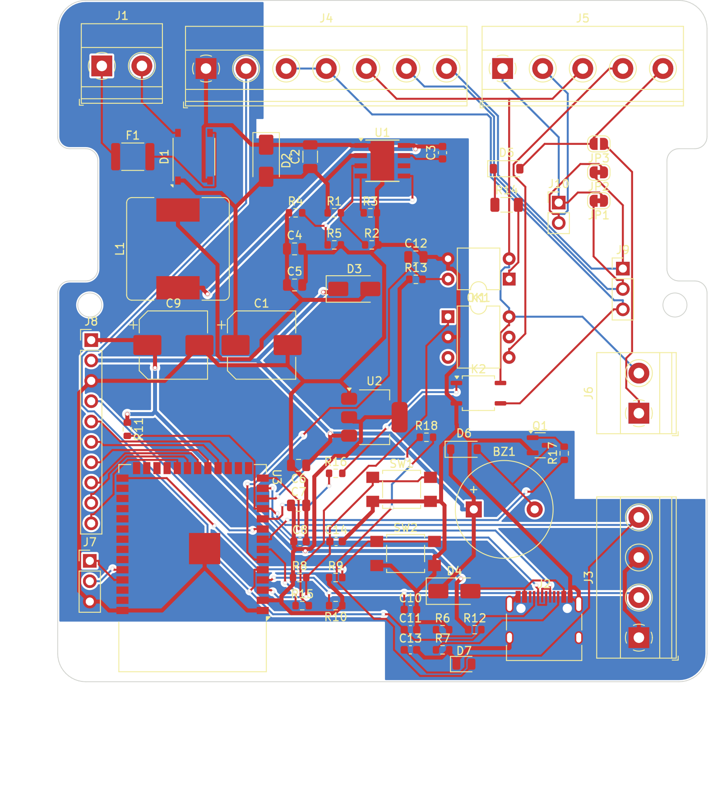

# Scheda principale (rev 0.5)

## File

| File | Contenuto |
|---|---|
| `CitofonoVintage.kicad_pro` | Progetto KiCad: apri questo. Contiene regole e classi di rete |
| `CitofonoVintage.kicad_sch` | Schema elettrico, con il campo **LCSC Part#** su ogni componente |
| `CitofonoVintage.kicad_pcb` | Circuito stampato sbrogliato |
| `CitofonoVintage_schematic.pdf` | Schema stampabile |
| `board_layers.pdf` | Strati del PCB. Stampato in scala 1:1 serve a verificare l'ingombro nel telefono |
| [`production/`](production) | Gerber, BOM e CPL per l'ordine assemblato su JLCPCB |

Il progetto è stato sviluppato con **KiCad 10**, che apre anche i file dei formati precedenti. Tutti i simboli e i footprint vengono dalle librerie ufficiali di KiCad e sono incorporati nei file, quindi non servono librerie esterne.

## Caratteristiche

| | |
|---|---|
| Dimensioni | 81 × 85 mm, contorno identico alla scheda originale S62 ([DXF](../mechanical/S62_board_outline.dxf)) |
| Strati | 2, FR-4 da 1,6 mm, rame da 1 oz |
| Alimentazione | 9–36 V DC o 9–24 V AC su J1, oppure 5 V da USB-C |
| Microcontrollore | ESP32-S3-WROOM-1-N16R2 (16 MB flash, 2 MB PSRAM) |
| Interfaccia linea | Optoisolatore PC817 (chiamata), PhotoMOS TLP3546A/AQV252G (apriporta), PhotoMOS CPC1017N (sgancio) |
| Isolamento | Barriera di 2,4 mm senza rame fra zona linea e zona logica |

## Regole di progetto

| Classe | Pista | Isolamento | Via | Reti |
|---|---|---|---|---|
| Default | 0,25 mm | 0,15 mm | 0,6 / 0,3 mm | segnali |
| Power | 0,5 mm | 0,15 mm | 0,8 / 0,4 mm | +5V, +3V3, +5V_BUCK, VIN_RAW, GND, U1_SW |

Minimi: pista 0,2 mm, via 0,5/0,2 mm, distanza dal bordo 0,2 mm. Sono tutti entro le capacità standard di JLCPCB.

**Zone:**
- `GND_plane`: sullo strato inferiore, solo nella zona logica. La massa è anche sbrogliata con piste, quindi il piano non è l'unico collegamento.
- `isolamento_1…6`: le strisce della barriera. Sono vietati piste, via e rame; pad e componenti sono ammessi, perché OK1, K1 e K2 stanno a cavallo.
- `antenna_keepout`: nessun rame sotto l'antenna del modulo ESP32.

**Stato DRC:** 0 connessioni mancanti e 0 violazioni elettriche. Restano solo avvisi di serigrafia sovrapposta, cosmetici.

## Componenti principali

| Rif | Componente | LCSC | Note |
|---|---|---|---|
| U1 | LM5164DDA (buck 1 A, fino a 100 V) | C477928 | |
| U2 | AMS1117-3.3 | C6186 | |
| U3 | ESP32-S3-WROOM-1-N16R2 | C2913205 | Richiede l'assemblaggio "Standard" |
| K1 | TLP3546A(F) o AQV252G, DIP-6 a foro passante | — | Da saldare a mano, da DigiKey o Mouser |
| K2 | CPC1017N | C81521 | |
| OK1 | PC817 | C3025068 | |
| D1 | ABS10 (ponte) | C400507 | |
| D2 | SMAJ36A (TVS) | C2760877 | |
| L1 | SRR1260-470M (47 µH) | C1329363 | |
| BZ1 | TMB12A05 (buzzer attivo 5 V) | C96093 | |
| J2 | USB-C HRO TYPE-C-31-M-12 | C165948 | |

La distinta completa è in [`production/BOM_JLCPCB.csv`](production/BOM_JLCPCB.csv). I componenti da saldare a mano sono elencati in [docs/ordinare-la-scheda.md](../../docs/ordinare-la-scheda.md#componenti-da-saldare-a-mano).

## Da sistemare nella prossima revisione

- La serigrafia di J1 dice "9-40 V": il valore corretto è **9–36 V DC / 9–24 V AC**, limitato dal TVS D2.
- Nel cartiglio dello schema: la revisione è ancora "0.3" e il titolo del blocco B dice ancora "N16R8" (il modulo montato è l'N16R2).
- Avvisi di serigrafia sovrapposta da ripulire.
- Da valutare dopo il collaudo: i valori di R14 (sensibilità della chiamata) e di R15/R16 (corrente nei LED dei PhotoMOS).
